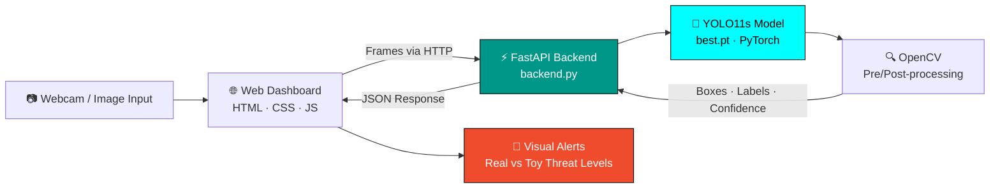

<div align="center">

# 🛡️ AI Weapon & Threat Detection System

An end-to-end, real-time computer vision system that detects weapons, separates **real threats** from **toy replicas**, and suppresses false alarms from **2D weapon prints** on clothing and posters.

[](https://www.python.org/)
[](https://pytorch.org/)
[](https://docs.ultralytics.com/)
[](https://fastapi.tiangolo.com/)
[](https://opencv.org/)
[](https://developer.mozilla.org/en-US/docs/Web/JavaScript)

[](https://github.com/furqanzubair209-cell/ai-weapon-threat-detection/stargazers)
[](https://github.com/furqanzubair209-cell/ai-weapon-threat-detection/network/members)
[](https://github.com/furqanzubair209-cell/ai-weapon-threat-detection/commits)
[](https://github.com/furqanzubair209-cell/ai-weapon-threat-detection)

**[Features](#-features) · [Architecture](#-architecture) · [Quick Start](#-quick-start) · [Training](#-training-pipeline) · [Project Structure](#-project-structure) · [Roadmap](#-roadmap)**

</div>

---

## 📸 Demo

<div align="center">

<!-- Replace with a screenshot or GIF of the dashboard detecting an object -->


*Live dashboard with webcam feed, confidence scores, and adjustable thresholds*

</div>

---

## ✨ Features

| | Feature | Description |
|---|---|---|
| 🎯 | **Real-Time Detection** | YOLO11s inference served through a low-latency FastAPI backend |
| 🔫 | **Dual-Tier Classification** | Separates **real weapons** (firearms, combat knives) from **toy weapons** (replicas) |
| 🧠 | **Hard-Negative Mining** | Trained on 2D drawings, posters, and illustrations with empty labels to cut false positives |
| 📷 | **Live Webcam Support** | Browser-based dashboard streams directly from the device camera |
| 📊 | **Confidence Metrics** | Per-detection confidence scores displayed in the UI |
| 🎚️ | **Adjustable Thresholds** | Tune sensitivity on the fly to match your deployment environment |
| 🪟 | **One-Click Launch** | `run_project.bat` starts the backend and dashboard on Windows |

---

## 🏗️ Architecture



---

## 🛠️ Tech Stack

| Layer | Technologies |
|---|---|
| **Model** | YOLO11s (Ultralytics), PyTorch |
| **Vision** | OpenCV |
| **Backend** | FastAPI, Uvicorn, Python |
| **Frontend** | HTML5, CSS3, JavaScript |
| **Training** | Google Colab, Jupyter Notebook |

---

## 🚀 Quick Start

### Prerequisites

- Python **3.10+**
- A webcam (optional, for live detection)
- Windows is recommended for the one-click launcher; the manual steps work on any OS

### 1. Clone the repository

```bash
git clone https://github.com/furqanzubair209-cell/ai-weapon-threat-detection.git
cd ai-weapon-threat-detection
```

### 2. Install dependencies

```bash
python -m venv venv
venv\Scripts\activate          # Windows
# source venv/bin/activate     # macOS / Linux

pip install -r requirements.txt
```

### 3. Run the application

**Option A: One-click (Windows)**

```bat
run_project.bat
```

**Option B: Manual**

```bash
uvicorn backend:app --host 127.0.0.1 --port 8000
```

Then open **http://127.0.0.1:8000** in your browser, allow webcam access, and start detecting.

> The trained weights (`best.pt`) are included in the repository, so the project runs immediately with no extra downloads.

---

## 🧪 Training Pipeline

The full training workflow lives in [`Weapon_Detection_System.ipynb`](Weapon_Detection_System.ipynb):

1. **Dataset curation**: collecting and organizing real weapon, toy weapon, and negative samples
2. **Hard-negative mining**: adding 2D weapon graphics (prints, posters, drawings) with empty label files so the model learns to ignore them
3. **Annotation conversion**: converting XML annotations to the YOLO format
4. **Two-stage training** with YOLO11s in PyTorch:
   - **Stage 1: Base training** for 100 epochs on the curated dataset
   - **Stage 2: Fine-tuning** for an additional 25 epochs to refine the model
5. **Export**: saving the best checkpoint as `best.pt` for deployment

---

## 📈 Results

| Metric | Value |
|---|---|
| mAP@0.5 | `TBD` |
| mAP@0.5:0.95 | `TBD` |
| Precision | `TBD` |
| Recall | `TBD` |
| Inference speed | `TBD` ms / frame |

> Fill in these values from your training run's `results.csv` or validation output.

---

## 📁 Project Structure

```text
ai-weapon-threat-detection/
├── frontend/                       # Web dashboard (HTML / CSS / JS)
├── backend.py                      # FastAPI inference server
├── best.pt                         # Fine-tuned YOLO11s weights
├── Weapon_Detection_System.ipynb   # Dataset, training, and export notebook
├── requirements.txt                # Python dependencies
├── run_project.bat                 # Windows one-click launcher
└── README.md                       # Project documentation
```

---

## 🗺️ Roadmap

- [ ] Multi-camera stream support (RTSP)
- [ ] Alert logging with timestamps and snapshots
- [ ] Export to ONNX / TensorRT for edge deployment
- [ ] Docker container for one-command setup

---

## 👨‍💻 Author

**Muhammad Furqan**: Frontend Software Engineer & Computer Science Undergraduate, Lahore, Pakistan

[](https://furqannewportfolio.netlify.app)
[](https://www.linkedin.com/in/muhammad-furqan-228807304)
[](https://github.com/furqanzubair209-cell)

---

## 🤝 Contributing

Contributions, issues, and feature requests are welcome. Feel free to open an [issue](https://github.com/furqanzubair209-cell/ai-weapon-threat-detection/issues) or submit a pull request.

---

## ⚠️ Disclaimer

This project is intended for **research, education, and security-system prototyping**. Automated detection should always be paired with human review. It is not a substitute for certified security infrastructure or law enforcement response.

---

<div align="center">

**If you found this project useful, please consider giving it a ⭐**

</div>
